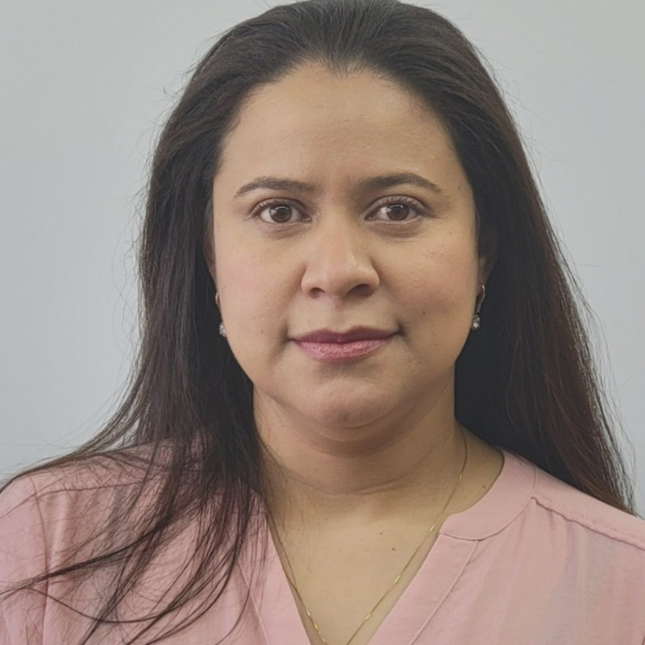

{width=45%}

Carolina is a Colombian commercial and maritime lawyer currently completing a Master’s in Business Analytics at Baruch College. Her academic background also includes an Associate’s degree in Business Administration from LaGuardia Community College. After successfully completing her initial studies and post-graduation work, she continues to serve LaGuardia within the Division of Student Affairs for the ACCES Pre-ETS program. Carolina is looking to merge her legal expertise with advanced research and data analysis to drive strategic business insights.

```{r}
#| include: false
1+1
```


```{r}
#| echo: false
#| message: false
#| warning: false

if(!require("leaflet")){
    options(repos=c(CRAN="https://cloud.r-project.org"))
    install.packages("leaflet")
    stopifnot(require("leaflet"))
}

baruch_longitude <- -73.98333
baruch_latitude  <- +40.74028

leaflet() |>
  addTiles() |>
  setView(baruch_longitude, baruch_latitude, zoom=17) |>
  addPopups(baruch_longitude, baruch_latitude, 
            "I am a Master's student at <b>Baruch College</b>!")
```